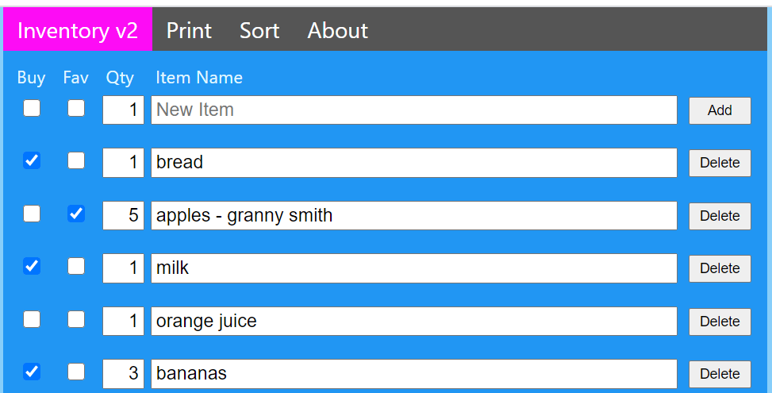

# Inventory v2 - by John Phillips on April 2, 2021.

## This React app was written as a single file of functions to better learn how React js works.

Source link: [https://github.com/profphillips/inventory-ui-v2](https://github.com/profphillips/inventory-ui-v2).

Live page link: [https://profphillips.github.io/inventory-ui-v2/](https://profphillips.github.io/inventory-ui-v2/).

This app calls inventory-api-v2 running on Heroku to access the mongodb atlas storage.

Source link: [https://github.com/profphillips/inventory-api-v2](https://github.com/profphillips/inventory-api-v2).

